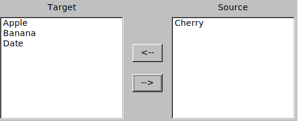

# DualListBox Widget for Go FLTK

This package provides a composite FLTK widget for Go called `DualListBox`, which allows users to move items between two lists using arrow buttons. The left list typically represents "used" or "selected" items, and the right list "available" items. It is ideal for filter selection, permissions, and similar UI patterns.


## Features

- Move items from the right (available) list to the left (used) list and vice versa.
- Items in both lists are always sorted alphabetically.
- Customizable list titles.
- Register callback handlers for both move-left and move-right actions.
- Easy integration with [go-fltk](https://github.com/pwiecz/go-fltk) applications.

## Installation

Make sure you have [go-fltk](https://github.com/pwiecz/go-fltk) installed and working.

Clone or copy this package into your project:

```sh
go get github.com/archeopternix/gofltk-duallistbox/duallistbox
```

## Usage

```go
package main

import (
	"fmt"
	"strings"

	"github.com/pwiecz/go-fltk"
)

func main() {
	win := fltk.NewWindow(600, 400)
	win.SetLabel("DualListBox Example")

	dual := NewDualListBox(20, 20, 560, 320)

	// Set initial items
	dual.SetLeftItems([]string{"foo", "bar"})
	dual.SetRightItems([]string{"alpha", "beta", "gamma", "delta"})

	// Set custom titles
	dual.SetLeftTitle("Selected Items")
	dual.SetRightTitle("Available Items")

	// Register event handlers
	dual.RegisterMoveLeftHandler(func() {
		fmt.Printf("Moved to left: %s\n", strings.Join(dual.GetLeftItems(), ", "))
	})
	dual.RegisterMoveRightHandler(func() {
		fmt.Printf("Moved to right: %s\n", strings.Join(dual.GetRightItems(), ", "))
	})

	win.End()
	win.Show()
	fltk.Run()
}
```

## API

### `type DualListBox`

Composite widget to move items between two lists.

#### Creation

```go
dual := NewDualListBox(x, y, w, h)
```

#### Item Management

- `SetLeftItems(items []string)` – Set items for the left (used) list.
- `SetRightItems(items []string)` – Set items for the right (available) list.
- `GetLeftItems() []string` – Get all items from the left list.
- `GetRightItems() []string` – Get all items from the right list.

#### Titles

- `SetLeftTitle(title string)` – Set the label above the left list.
- `SetRightTitle(title string)` – Set the label above the right list.

#### Event Handlers

- `RegisterMoveLeftHandler(func())` – Set callback for when an item is moved from right to left.
- `RegisterMoveRightHandler(func())` – Set callback for when an item is moved from left to right.

#### Layout

- `Resize(x, y, w, h int)` – Resize and move the widget and its children.


## License

MIT License. See [LICENSE](LICENSE).